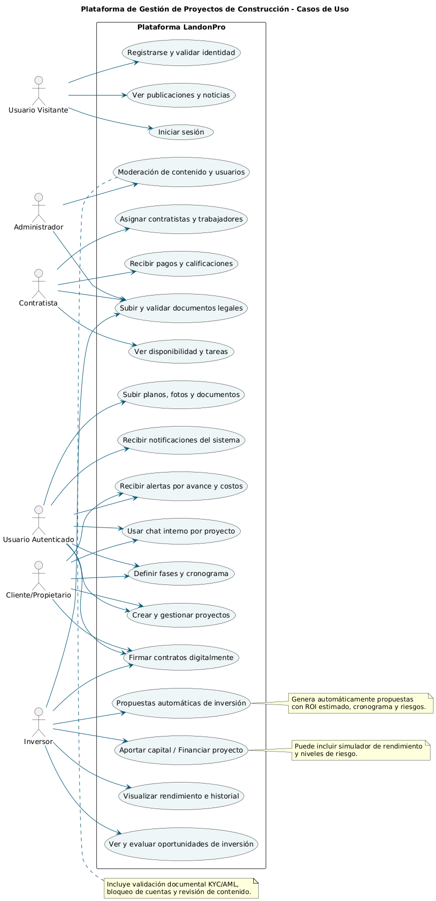

## Índice

0. [Ficha del proyecto](#0-ficha-del-proyecto)
1. [Descripción general del producto](#1-descripción-general-del-producto)
2. [Arquitectura del sistema](#2-arquitectura-del-sistema)
3. [Modelo de datos](#3-modelo-de-datos)
4. [Especificación de la API](#4-especificación-de-la-api)
5. [Historias de usuario](#5-historias-de-usuario)
6. [Tickets de trabajo](#6-tickets-de-trabajo)
7. [Pull requests](#7-pull-requests)

---

## 0. Ficha del proyecto

### **0.1. Tu nombre completo: Jorge Luis Córdoba Montes

### **0.2. Nombre del proyecto:LandonPro

### **0.3. Descripción breve del proyecto:
Industria: Construcción, Inversión Inmobiliaria y Tecnología
Tipo de aplicación: Plataforma de gestión integral para proyectos de construcción y remodelación con enfoque en inversión automatizada.

LandonPro es una aplicación diseñada para transformar la industria de la construcción e inversión inmobiliaria, digitalizando la manera en que las constructoras, inversionistas y contratistas gestionan, financian y ejecutan proyectos de remodelación, especialmente bajo el modelo Fix and Flip.

Objetivo General

Crear una plataforma tecnológica centralizada que:
	•	Permita gestionar proyectos de construcción o remodelación desde una interfaz simple e intuitiva.
	•	Automatice propuestas de inversión, reportes de avance, presupuestos y cronogramas.
	•	Conecte a inversionistas, contratistas y proveedores en un mismo ecosistema.
	•	Brinde un seguimiento en tiempo real del estado de cada propiedad.

Características a Desarrollar
	1.	Registro de propiedades con opción de subir fotos, planos y estado actual.
	2.	Panel de control para proyectos, incluyendo tareas por fases (demolición, construcción, acabados, etc.).
	3.	Módulo de propuestas automáticas para presentar proyectos a inversionistas con ROI estimado.
	4.	Sistema de financiamiento integrado (opcional): espacio para que inversionistas analicen y aporten capital.
	5.	Dashboard de inversión: Rendimiento por proyecto, historial y proyecciones.
	6.	Gestión de contratistas y proveedores: Calendario de disponibilidad, asignación y pagos.
	7.	Alertas automáticas: sobre tiempos, costos, o desviaciones del plan.
	8.	Comunicación interna: chat por proyecto entre partes implicadas (gerente, inversionista, contratista).
	9.	Documentación legal y contractual digitalizada para facilitar el cierre de acuerdos. PLANTILLAS
    10. NOTICIAS O PUBLICACIONES que puedan publicar dueños de proyectos e inversionistas y van a tener comentarios TIPO BLOG.

Debe tener estos perfiles 
👔 1. Inversores

📌 Objetivo: asegurar que el origen del capital sea lícito y que el perfil sea confiable.

Documentos requeridos:
	•	Cédula o pasaporte vigente (ID oficial)
	•	Prueba de fondos (bank statement, carta bancaria)
	•	Formulario W-9 (EE.UU.) o su equivalente tributario
	•	Contrato de inversión firmado
	•	Formulario de evaluación del perfil de riesgo
	•	Verificación de dirección (factura de servicios o lease)

Opcional (para inversores mayores):
	•	Certificación de “inversor acreditado” (si aplica)
	•	Reporte de antecedentes financieros o legales (si es privado 1 a 1)

⸻

🧱 2. Trabajadores (obreros, técnicos, arquitectos, supervisores)

📌 Objetivo: validar identidad, habilidades y referencias reales.

Documentos requeridos:
	•	Identificación oficial (ID estatal o licencia de conducir)
	•	Número de Seguro Social o ITIN (EE.UU.)
	•	Certificados de capacitación técnica (OSHA, construcción, etc.)
	•	Currículum o ficha de experiencia laboral
	•	Referencias laborales comprobables
	•	Contrato o carta de trabajo firmada
	•	Foto tipo carnet actualizada

⸻

🏗️ 3. Compañías Constructoras / Contratistas

📌 Objetivo: confirmar que son empresas registradas, activas y con permisos válidos.

Documentos requeridos:
	•	Certificado de registro de la empresa (Articles of Organization)
	•	Licencia de contratista general vigente
	•	Seguro de responsabilidad civil (general liability insurance)
	•	Seguro de compensación laboral (worker’s comp)
	•	Lista de proyectos anteriores (portafolio o dossier técnico)
	•	Contacto directo del responsable legal y operativo
	•	Contrato marco con LandonPro

⸻

👥 4. Usuarios Generales / Clientes Interesados

📌 Objetivo: validar identidad básica, evitar suplantación y crear una comunidad legítima.

Documentos requeridos:
	•	Identificación oficial con foto (cédula, pasaporte, licencia)
	•	Correo electrónico y número celular verificados
	•	Selfie en tiempo real para verificación facial (opcional pero recomendable)
	•	Contrato de reserva, compra o inversión digital con firma electrónica
	•	Declaración de conformidad con términos y condiciones
Administrador 
Administrar el sitio y generar el token 

### **0.4. URL del proyecto:**

> Puede ser pública o privada, en cuyo caso deberás compartir los accesos de manera segura. Puedes enviarlos a [alvaro@lidr.co](mailto:alvaro@lidr.co) usando algún servicio como [onetimesecret](https://onetimesecret.com/).

### 0.5. URL o archivo comprimido del repositorio

> Puedes tenerlo alojado en público o en privado, en cuyo caso deberás compartir los accesos de manera segura. Puedes enviarlos a [alvaro@lidr.co](mailto:alvaro@lidr.co) usando algún servicio como [onetimesecret](https://onetimesecret.com/). También puedes compartir por correo un archivo zip con el contenido

---

## 1. Descripción general del producto

> Describe en detalle los siguientes aspectos del producto: LandonPro

### **1.1. Objetivo:**

Plataforma de gestión integral para proyectos de construcción y remodelación con enfoque en inversión automatizada.

### **1.2. Características y funcionalidades principales:**

Crear una plataforma tecnológica centralizada que:
	•	Permita gestionar proyectos de construcción o remodelación desde una interfaz simple e intuitiva.
	•	Automatice propuestas de inversión, reportes de avance, presupuestos y cronogramas.
	•	Conecte a inversionistas, contratistas y proveedores en un mismo ecosistema.
	•	Brinde un seguimiento en tiempo real del estado de cada propiedad.

Características a Desarrollar
	1.	Registro de propiedades con opción de subir fotos, planos y estado actual.
	2.	Panel de control para proyectos, incluyendo tareas por fases (demolición, construcción, acabados, etc.).
	3.	Módulo de propuestas automáticas para presentar proyectos a inversionistas con ROI estimado.
	4.	Sistema de financiamiento integrado (opcional): espacio para que inversionistas analicen y aporten capital.
	5.	Dashboard de inversión: Rendimiento por proyecto, historial y proyecciones.
	6.	Gestión de contratistas y proveedores: Calendario de disponibilidad, asignación y pagos.
	7.	Alertas automáticas: sobre tiempos, costos, o desviaciones del plan.
	8.	Comunicación interna: chat por proyecto entre partes implicadas (gerente, inversionista, contratista).
	9.	Documentación legal y contractual digitalizada para facilitar el cierre de acuerdos. PLANTILLAS
    10. NOTICIAS O PUBLICACIONES que puedan publicar dueños de proyectos e inversionistas y van a tener comentarios TIPO BLOG.

Debe tener estos perfiles 
👔 1. Inversores

📌 Objetivo: asegurar que el origen del capital sea lícito y que el perfil sea confiable.

Documentos requeridos:
	•	Cédula o pasaporte vigente (ID oficial)
	•	Prueba de fondos (bank statement, carta bancaria)
	•	Formulario W-9 (EE.UU.) o su equivalente tributario
	•	Contrato de inversión firmado
	•	Formulario de evaluación del perfil de riesgo
	•	Verificación de dirección (factura de servicios o lease)

Opcional (para inversores mayores):
	•	Certificación de “inversor acreditado” (si aplica)
	•	Reporte de antecedentes financieros o legales (si es privado 1 a 1)

⸻

🧱 2. Trabajadores (obreros, técnicos, arquitectos, supervisores)

📌 Objetivo: validar identidad, habilidades y referencias reales.

Documentos requeridos:
	•	Identificación oficial (ID estatal o licencia de conducir)
	•	Número de Seguro Social o ITIN (EE.UU.)
	•	Certificados de capacitación técnica (OSHA, construcción, etc.)
	•	Currículum o ficha de experiencia laboral
	•	Referencias laborales comprobables
	•	Contrato o carta de trabajo firmada
	•	Foto tipo carnet actualizada

⸻

🏗️ 3. Compañías Constructoras / Contratistas

📌 Objetivo: confirmar que son empresas registradas, activas y con permisos válidos.

Documentos requeridos:
	•	Certificado de registro de la empresa (Articles of Organization)
	•	Licencia de contratista general vigente
	•	Seguro de responsabilidad civil (general liability insurance)
	•	Seguro de compensación laboral (worker’s comp)
	•	Lista de proyectos anteriores (portafolio o dossier técnico)
	•	Contacto directo del responsable legal y operativo
	•	Contrato marco con LandonPro

⸻

👥 4. Usuarios Generales / Clientes Interesados

📌 Objetivo: validar identidad básica, evitar suplantación y crear una comunidad legítima.

Documentos requeridos:
	•	Identificación oficial con foto (cédula, pasaporte, licencia)
	•	Correo electrónico y número celular verificados
	•	Selfie en tiempo real para verificación facial (opcional pero recomendable)
	•	Contrato de reserva, compra o inversión digital con firma electrónica
	•	Declaración de conformidad con términos y condiciones

### **1.3. Diseño y experiencia de usuario:**

> Proporciona imágenes y/o videotutorial mostrando la experiencia del usuario desde que aterriza en la aplicación, pasando por todas las funcionalidades principales.

### **1.4. Instrucciones de instalación:**
> Documenta de manera precisa las instrucciones para instalar y poner en marcha el proyecto en local (librerías, backend, frontend, servidor, base de datos, migraciones y semillas de datos, etc.)

Para poner en marcha LandonPro en tu entorno local, sigue las instrucciones a continuación, que cubren el backend (Laravel) y el frontend (Flutter).

1.4.1. Requisitos Previos
Asegúrate de tener instalados los siguientes componentes en tu sistema:

PHP: Versión 8.1 o superior.
Composer: Gestor de dependencias de PHP.
Node.js y npm/yarn: Para la compilación de assets si utilizas Laravel Mix.
MySQL o PostgreSQL: Para la base de datos. (Ver sección 1.4.2 para más detalles).
Flutter SDK: Versión 3.x o superior.
Dart SDK: Viene incluido con Flutter.
Git: Para clonar el repositorio.
---

## 2. Arquitectura del Sistema

### **2.1. Diagrama de arquitectura:**
> Usa el formato que consideres más adecuado para representar los componentes principales de la aplicación y las tecnologías utilizadas. Explica si sigue algún patrón predefinido, justifica por qué se ha elegido esta arquitectura, y destaca los beneficios principales que aportan al proyecto y justifican su uso, así como sacrificios o déficits que implica.

🎯 Casos de Uso Fundamentales
1. Registro y Autenticación de Usuarios
Actores: Todos los perfiles (Inversores, Trabajadores, Contratistas, Clientes)

Descripción: Permite registrarse, subir documentos requeridos según el perfil y verificar identidad.

Extensiones: Revisión manual o automática de documentos, autenticación de dos factores, selfie con IA.

2. Gestión de Proyectos Inmobiliarios
Actores: Clientes, Contratistas, Administradores

Descripción: Crear, editar, y visualizar proyectos. Incluir fases (demolición, construcción, acabados), tareas y cronograma.

Incluye: Subida de planos, fotos y estado actual. Asignación de contratistas.

3. Propuestas Automatizadas de Inversión
Actores: Inversores, Administradores

Descripción: Generación automática de propuestas para inversión con ROI estimado, tiempos, riesgos y plan financiero.

Incluye: PDF descargable, firma digital de intención.

4. Panel de Inversor y Financiamiento
Actores: Inversores

Descripción: Dashboard con inversiones activas, proyecciones, rendimiento y opciones para invertir.

Extensiones: Simulador de retorno, alertas personalizadas.

5. Gestión de Contratistas y Personal Técnico
Actores: Contratistas, Trabajadores, Administradores

Descripción: Registro, validación de documentos, disponibilidad en calendario, historial de trabajos y pagos.

Incluye: Evaluaciones por proyecto, asignación de fases.

6. Seguimiento en Tiempo Real
Actores: Todos

Descripción: Visualización del estado de cada proyecto (fotos, avances, tareas cumplidas, alertas).

Incluye: Vista tipo Gantt, porcentaje de avance, actualizaciones automáticas.

7. Alertas y Notificaciones Automatizadas
Actores: Todos

Descripción: Notificación de retrasos, sobrecostos, cambios de estado o desviaciones de cronograma.

Medios: App, correo, WhatsApp o notificaciones push.

8. Comunicación Interna por Proyecto
Actores: Inversores, Contratistas, Clientes, Supervisores

Descripción: Chat privado por proyecto con historial, adjuntos y menciones.

Opcional: Integración con herramientas externas como Slack o Telegram.

9. Gestión Documental y Contratos Digitales
Actores: Todos

Descripción: Subida, visualización y firma electrónica de contratos, formularios y documentos legales.

Extensiones: Plantillas automáticas por tipo de usuario y proyecto.

10. Módulo de Noticias y Publicaciones (Tipo Blog)
Actores: Inversores, Clientes, Administradores

Descripción: Publicar novedades, ideas, oportunidades de inversión o estado de mercado. Permite comentarios.

Incluye: Etiquetas, búsqueda y filtros por tipo de contenido.

🧩 Casos de Uso Complementarios
11. Validación de Documentos y Cumplimiento Legal (KYC)
Actores: Administradores

Descripción: Validar automáticamente documentos mediante APIs o revisión manual para cumplir normativa KYC/AML.

12. Módulo de Evaluación de Riesgo de Inversión
Actores: Inversores

Descripción: Cuestionario y análisis del perfil de riesgo. Recomendación de proyectos según apetito de riesgo.

13. Sistema de Pagos y Transacciones
Actores: Inversores, Clientes, Contratistas

Descripción: Registro y control de pagos, aportes, desembolsos y compensaciones.

14. Sistema de Calificación y Reseñas
Actores: Todos

Descripción: Permite evaluar el desempeño de contratistas, proveedores e incluso proyectos desde la experiencia de usuario.

@startuml
title Plataforma de Gestión de Proyectos de Construcción - Casos de Uso

!define RECTANGLE class
left to right direction
skinparam packageStyle rectangle
skinparam usecase {
  BackgroundColor #EEF6F8
  BorderColor black
  ArrowColor #005577
}

actor "Usuario Visitante" as Visitante
actor "Usuario Autenticado" as Usuario
actor "Administrador" as Admin
actor "Contratista" as Contratista
actor "Inversor" as Inversor
actor "Cliente/Propietario" as Cliente

rectangle "Plataforma LandonPro" {

  usecase "Ver publicaciones y noticias" as UC1
  usecase "Registrarse y validar identidad" as UC2
  usecase "Iniciar sesión" as UC3

  usecase "Crear y gestionar proyectos" as UC4
  usecase "Subir planos, fotos y documentos" as UC5
  usecase "Definir fases y cronograma" as UC6
  usecase "Recibir alertas por avance y costos" as UC7

  usecase "Propuestas automáticas de inversión" as UC8
  usecase "Ver y evaluar oportunidades de inversión" as UC9
  usecase "Aportar capital / Financiar proyecto" as UC10
  usecase "Visualizar rendimiento e historial" as UC11

  usecase "Asignar contratistas y trabajadores" as UC12
  usecase "Ver disponibilidad y tareas" as UC13
  usecase "Recibir pagos y calificaciones" as UC14

  usecase "Firmar contratos digitalmente" as UC15
  usecase "Subir y validar documentos legales" as UC16

  usecase "Usar chat interno por proyecto" as UC17
  usecase "Recibir notificaciones del sistema" as UC18

  usecase "Moderación de contenido y usuarios" as UC19
}

' Relación con visitantes
Visitante --> UC1
Visitante --> UC2
Visitante --> UC3

' Relación con usuarios autenticados (general)
Usuario --> UC4
Usuario --> UC5
Usuario --> UC6
Usuario --> UC7
Usuario --> UC15
Usuario --> UC17
Usuario --> UC18

' Contratista
Contratista --> UC12
Contratista --> UC13
Contratista --> UC14
Contratista --> UC16

' Inversor
Inversor --> UC8
Inversor --> UC9
Inversor --> UC10
Inversor --> UC11
Inversor --> UC15
Inversor --> UC16

' Cliente
Cliente --> UC4
Cliente --> UC6
Cliente --> UC7
Cliente --> UC15
Cliente --> UC17

' Administrador
Admin --> UC16
Admin --> UC19

note right of UC8
Genera automáticamente propuestas
con ROI estimado, cronograma y riesgos.
end note

note right of UC10
Puede incluir simulador de rendimiento
y niveles de riesgo.
end note

note top of UC19
Incluye validación documental KYC/AML,
bloqueo de cuentas y revisión de contenido.
end note

@enduml

### **2.2. Descripción de componentes principales:**

> Describe los componentes más importantes, incluyendo la tecnología utilizada

Configuración de la Base de Datos
Para LandonPro, considerando la naturaleza del proyecto con gestión de datos relacionales (proyectos, usuarios, propiedades, etc.) y la necesidad de transacciones robustas, MySQL es una excelente opción. Si bien Firebase (Firestore) es ideal para aplicaciones con estructuras de datos más flexibles y sincronización en tiempo real, para un proyecto con un enfoque tan fuerte en la interconexión de entidades y la integridad de los datos como LandonPro, una base de datos relacional como MySQL te brindará mayor control y escalabilidad en la gestión de tus relaciones de datos complejas.
ACA SE DETERMINO QUE ERA MEJOR UTILIZAR MYSQL QUE FIREBASE

### **2.3. Descripción de alto nivel del proyecto y estructura de ficheros**

> Representa la estructura del proyecto y explica brevemente el propósito de las carpetas principales, así como si obedece a algún patrón o arquitectura específica.

### **2.4. Infraestructura y despliegue**

> Detalla la infraestructura del proyecto, incluyendo un diagrama en el formato que creas conveniente, y explica el proceso de despliegue que se sigue

### **2.5. Seguridad**

> Enumera y describe las prácticas de seguridad principales que se han implementado en el proyecto, añadiendo ejemplos si procede

### **2.6. Tests**

> Describe brevemente algunos de los tests realizados

---

## 3. Modelo de Datos

### **3.1. Diagrama del modelo de datos:**

> Recomendamos usar mermaid para el modelo de datos, y utilizar todos los parámetros que permite la sintaxis para dar el máximo detalle, por ejemplo las claves primarias y foráneas.

### **3.2. Descripción de entidades principales:**

> Recuerda incluir el máximo detalle de cada entidad, como el nombre y tipo de cada atributo, descripción breve si procede, claves primarias y foráneas, relaciones y tipo de relación, restricciones (unique, not null…), etc.

---

## 4. Especificación de la API

> Si tu backend se comunica a través de API, describe los endpoints principales (máximo 3) en formato OpenAPI. Opcionalmente puedes añadir un ejemplo de petición y de respuesta para mayor claridad

landonpro-api/
├── app/
│   ├── Http/
│   │   ├── Controllers/
│   │   │   └── Api/  (Directorio base para todos los controladores de la API)
│   │   │       ├── Auth/
│   │   │       │   ├── LoginController.php
│   │   │       │   ├── RegisterController.php
│   │   │       │   └── PasswordResetController.php
│   │   │       │
│   │   │       ├── PlatformAdmin/ (Panel del Administrador de Plataforma)
│   │   │       │   ├── UserManagementController.php      (Gestionar usuarios)
│   │   │       │   ├── CompanyVerificationController.php (Verificar constructoras)
│   │   │       │   ├── ProjectOversightController.php    (Monitorear proyectos)
│   │   │       │   └── SystemSettingsController.php      (Gestionar plantillas, etc.)
│   │   │       │
│   │   │       ├── UserProfile/ (Perfil del usuario autenticado)
│   │   │       │   ├── ProfileController.php             (Ver/actualizar mi perfil)
│   │   │       │   ├── MyDocumentsController.php         (Subir/ver mis documentos)
│   │   │       │   └── MyInvestmentsController.php       (Ver mis inversiones)
│   │   │       │
│   │   │       ├── ProjectManagement/ (Constructores y Gerentes de Proyecto)
│   │   │       │   ├── ProjectController.php             (CRUD de Proyectos)
│   │   │       │   ├── TaskController.php                (CRUD de Tareas de un proyecto)
│   │   │       │   ├── ProjectMediaController.php        (Gestionar fotos/planos)
│   │   │       │   └── ProjectWorkerController.php       (Asignar trabajadores a un proyecto)
│   │   │       │
│   │   │       ├── Investor/ (Funcionalidades para el Inversor)
│   │   │       │   ├── ProjectListingController.php      (Ver proyectos que buscan fondos)
│   │   │       │   └── InvestmentController.php          (Realizar una inversión)
│   │   │       │
│   │   │       ├── Community/ (Blog, Comentarios)
│   │   │       │   ├── PostController.php
│   │   │       │   └── CommentController.php
│   │   │       │
│   │   │       └── Chat/
│   │   │           ├── ChatRoomController.php
│   │   │           └── ChatMessageController.php
│   │   │
│   │   ├── Middleware/
│   │   │   ├── IsPlatformAdmin.php  (Verifica si el usuario tiene el rol 'platform_admin')
│   │   │   ├── IsInvestor.php       (Verifica si el usuario tiene el rol 'investor')
│   │   │   └── ... (otros middlewares de rol si son necesarios)
│   │   │
│   │   ├── Requests/ (Para validación de formularios)
│   │   │   ├── StoreProjectRequest.php
│   │   │   ├── StoreInvestmentRequest.php
│   │   │   ├── StorePostRequest.php
│   │   │   └── ... (otros archivos de validación)
│   │   │
│   │   └── Resources/ (Para transformar los modelos a JSON)
│   │       ├── UserResource.php
│   │       ├── ProjectResource.php
│   │       ├── ProjectDetailResource.php
│   │       ├── InvestmentResource.php
│   │       └── ... (un Resource por cada modelo principal)
│   │
│   ├── Models/ (Aquí van todos tus modelos, uno por tabla)
│   │   ├── User.php
│   │   ├── Company.php
│   │   ├── Project.php
│   │   ├── Task.php
│   │   ├── Investment.php
│   │   ├── Document.php
│   │   ├── ProjectMedia.php
│   │   ├── Supplier.php
│   │   ├── Post.php
│   │   ├── Comment.php
│   │   ├── ChatRoom.php
│   │   ├── ChatMessage.php
│   │   ├── Notification.php
│   │   └── DocumentTemplate.php
│   │
│   └── Providers/
│       └── AuthServiceProvider.php (Para definir Policies/Políticas de acceso)
│
├── database/
│   ├── factories/ (Para generar datos de prueba)
│   ├── migrations/ (Aquí se traducirá tu script SQL a código PHP)
│   └── seeders/
│       ├── DatabaseSeeder.php
│       └── ... (seeders para usuarios, proyectos, etc.)
│
├── resources/
│   └── views/ (NO para la app, SÓLO para emails y quizás una página de reseteo de contraseña)
│       └── emails/
│           ├── auth/
│           │   ├── welcome.blade.php
│           │   └── password-reset.blade.php
│           │
│           ├── notifications/
│           │   ├── project_update.blade.php
│           │   ├── new_investment_alert.blade.php
│           │   └── document_verified.blade.php
│
└── routes/
    └── api.php (El mapa de todas tus rutas de la API)

---

## 5. Historias de Usuario

> Documenta 3 de las historias de usuario principales utilizadas durante el desarrollo, teniendo en cuenta las buenas prácticas de producto al respecto.

**Historia de Usuario 1**

**Historia de Usuario 2**

**Historia de Usuario 3**

---

## 6. Tickets de Trabajo

> Documenta 3 de los tickets de trabajo principales del desarrollo, uno de backend, uno de frontend, y uno de bases de datos. Da todo el detalle requerido para desarrollar la tarea de inicio a fin teniendo en cuenta las buenas prácticas al respecto. 

**Ticket 1**

**Ticket 2**

**Ticket 3**

---

## 7. Pull Requests

> Documenta 3 de las Pull Requests realizadas durante la ejecución del proyecto

**Pull Request 1**

**Pull Request 2**

**Pull Request 3**

